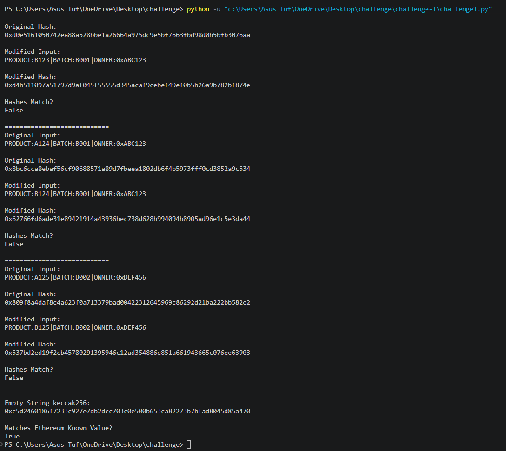

# Challenge 1 — Hashing & The Avalanche Effect

## What is Hashing?

Hashing converts input data into a fixed-length output called a hash.

---

## What is the Avalanche Effect?

A very small change in input causes a completely different hash output.

Example:

PRODUCT:A123|BATCH:B001|OWNER:0xABC123

changed to:

PRODUCT:B123|BATCH:B001|OWNER:0xABC123

This small change completely changed the generated hash.

---

## Why combine four inputs instead of using block.timestamp alone?

Using only block.timestamp is predictable.

Combining:
- id
- timestamp
- sender address
- previous block hash

makes the hash more secure and harder to predict or clone.

---

## What happens if an attacker reuses an old QR code later?

The QR salt changes continuously.

After ownership transfer or time change, the old QR becomes invalid.

This prevents replay attacks and fake product cloning.

