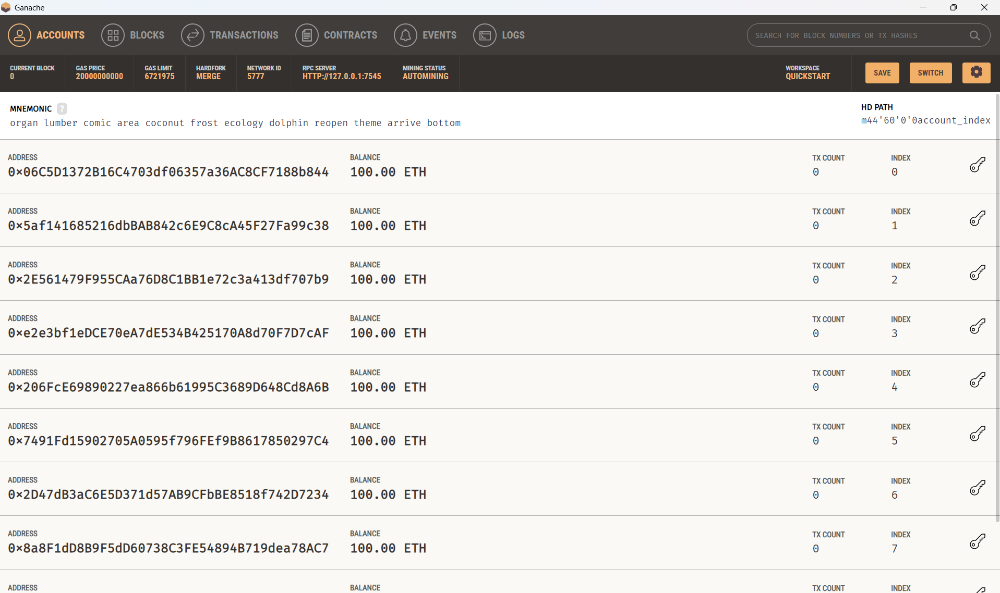
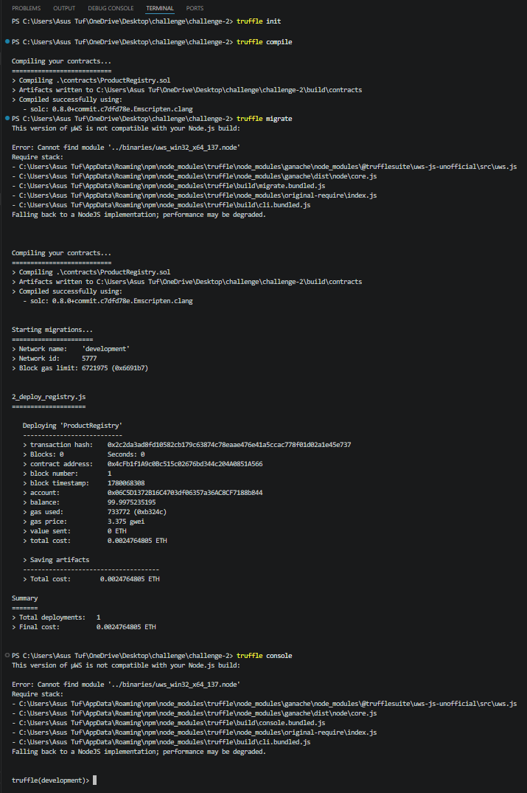
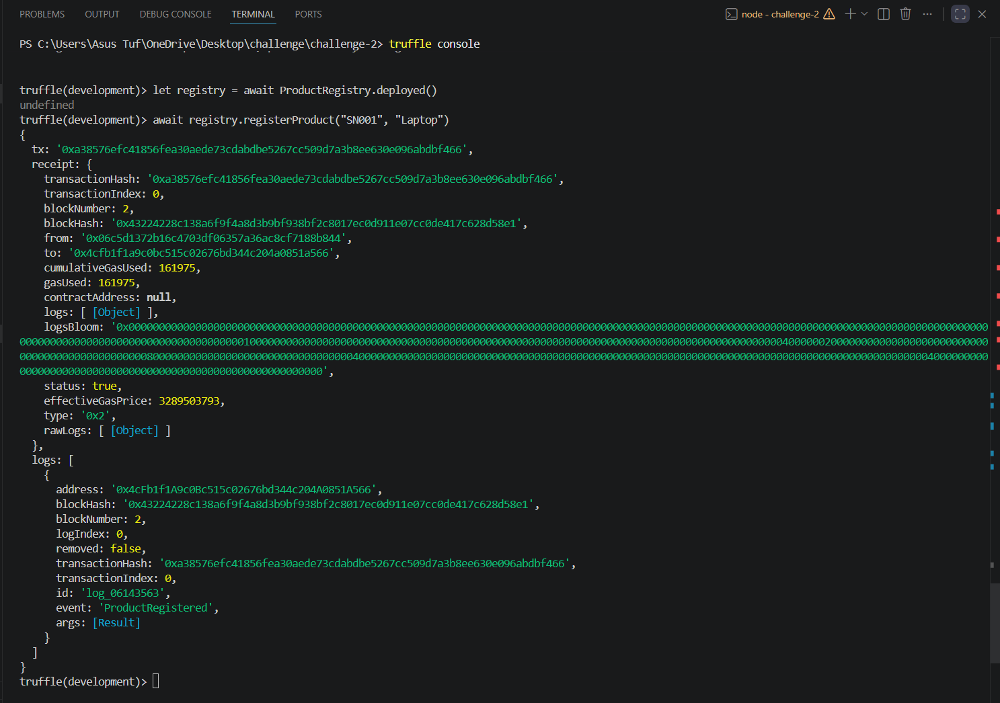

Q1. What is msg.sender?
msg.sender is the address of the user or account that calls a smart contract function.
No, a contract cannot lie about msg.sender because Ethereum automatically provides the real caller address.

Q2. Why onlyNewSerial is important?
The onlyNewSerial modifier prevents duplicate serial numbers.
This is important because every product should have a unique identity in a product authentication system. Without it, fake or duplicate products could be registered.

Q3. Difference Between .call() and .send()
.call() is used for reading blockchain data.
It does not change blockchain state and does not cost gas.

.send() is used for writing or updating blockchain data.
It changes blockchain state and costs gas.